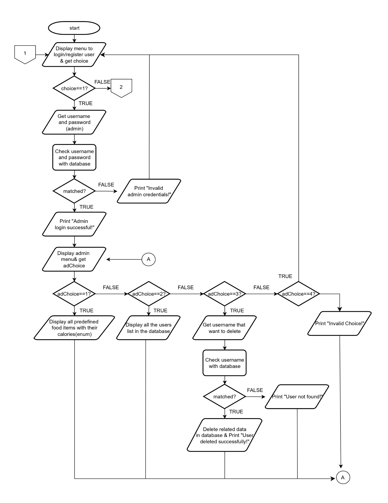

# 🍏🥦🥑 Nutrition Tracker System 🍏🥦🥑

Ⓦⓔⓛⓒⓞⓜⓔ ⓣⓞ ⓝⓤⓣⓡⓘⓣⓘⓞⓝ ⓣⓡⓐⓒⓚⓔⓡ ⓢⓨⓢⓣⓔⓜ !!

> This system helps you keep track of your daily food intake, monitor your nutritional goals, and maintain a balanced diet. 🫐

##  🥗 𝐅𝐞𝐚𝐭𝐮𝐫𝐞𝐬 🥗

📊 **Daily Tracking**: Log your daily meals and snacks.

⚖️ **BMI Calculation**: Calculate your Body Mass Index (BMI) to monitor your health and fitness progress.

📝 **Meal Recording**: Users can log their meals, including meal type, date, and food items.

✏️ **Meal Editing**: Easily edit your logged meals to ensure accurate tracking.

📈 **Meal Reports**: View your meals over date with visual reports.

👥 **User Management**: Admins can view food items, manage users, and delete user accounts.

🔒 **Secure Login**: Both admin and regular users can securely log in to access their personalized features.

🍏🥦🥑

## 🥗 𝐒𝐲𝐬𝐭𝐞𝐦 𝐏𝐫𝐞𝐯𝐢𝐞𝐰 🥗
code

🍏🥦🥑

## 🥗 𝐅𝐥𝐨𝐰𝐂𝐡𝐚𝐫𝐭 🥗

🍏🥦🥑

## 🥗 𝐂𝐥𝐚𝐬𝐬 𝐃𝐢𝐚𝐠𝐫𝐚𝐦 🥗

